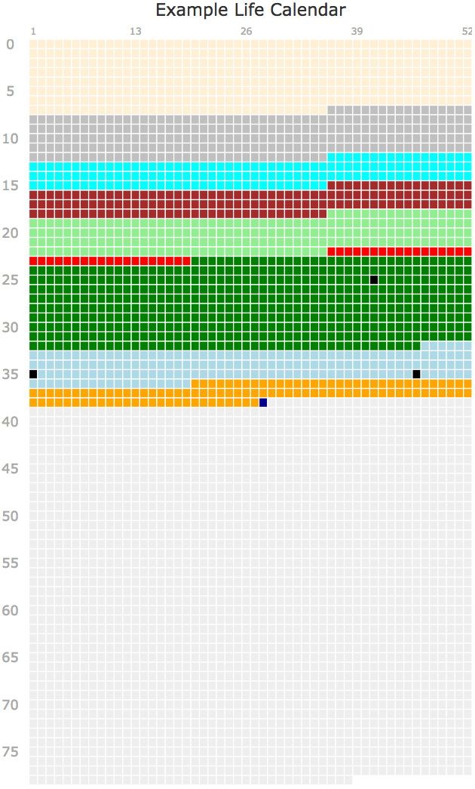

# react-lifecalendar

A React/SVG-based "Life Calendar" component, inspired by [this article](http://waitbutwhy.com/2014/05/life-weeks.html) written by Tim Urban.



## Introduction

A Life Calendar is a chart that shows your life (or someone elses!) in weeks, where each week is denoted by a square on the chart. If you haven't already, I would recommend reading [this article](http://waitbutwhy.com/2014/05/life-weeks.html) by Tim Urban, who introduces this concept.

This component is an React-based implementation of a Life Calendar that renders to SVG, and can displayed in all modern browsers.

## Running the Example

You'll need [Node](http://nodejs.org) (preferably 5.x or higher) to be installed. Clone this repo, change into the directory, and run the following command to install all dependencies:

```
npm install
```

Once this is complete, you can run the example with:

```
npm start
```

With the server up and running, browse to http://localhost:8000 to view the component with sample data (available in ./example/components/App.js). Hover over the elements to display a tooltip corresponding with the data.

This example is also compatible with the Webpack Hot Reloader (HMR), invoked by webpack-dev-server example/.

## Installation

To use the component in your own React-based project:

```
npm i react-lifecalendar --save
```

To import the component:

```
import LifeCalendar from 'react-lifecalendar'
```

### Usage

You should initialize the calendar with a width, height, title, and data object:

```
<LifeCalendar width="500" height="1000" title="Example Life Calendar" data={data}/>
```

A ratio of 1:2 (width:height) is recommended for the control, although it should scale accordingly.

### Data

Data is passed to the calendar as a JSON object, and should compromise of the following fields:

**dob** (required) - Date of Birth in MM/DD/YYYY format (e.g. 01/01/1980)

**lifeExpectancy** (required) - Life Expectancy in years (e.g 78.1)

**ranges** - A collection of ranges to display in the calendar. Each range should have the following values:

**start** - Start date in MM/DD/YYYY format

**end** - End date in MM/DD/YYYY format. If the end date is not supplied, the current date will be used (useful for current events).

**title** - Text to show in the tooltip

**color** - SVG-compliant color to show. Can either be a named color, RGB value (e.g. rgb(255,255,255), or Hex value (e.g. #eeeeee).

**milestones** - A collection of milestones to show in the calendar. Each milestone should have the following value:

**date** - Date in MM/DD/YYYY format

**title** - Text to show in the tooltip

Overrides include:

**dateFormat** - Override the default date format with a [moment-compatible](https://www.npmjs.com/package/moment) format (e.g. DD/MM/YYYY)

**milestoneColor** - Override the color for milestones (shown by default as black)

### Example Data

```
const data = {
  dob: '01/01/1978',
  lifeExpectancy: 78.74,
  ranges: [
    {start: '01/01/1978', end: '09/01/1993', title: 'Junior School', color: 'papayawhip'},
    {start: '09/01/1985', end: '09/01/1990', title: 'Elementary School', color: 'silver'},
    {start: '09/01/1990', end: '09/01/1993', title: 'Junior School', color: 'aqua'},
    {start: '09/01/1993', end: '09/01/1996', title: 'High School', color: 'brown'},
    {start: '09/01/1996', end: '09/01/2000', title: 'College', color: 'lightgreen'},
    {start: '09/01/2000', end: '05/14/2001', title: 'Internship', color: 'red'},
    {start: '05/14/2001', end: '11/20/2010', title: 'My First Job', color: 'green'},
    {start: '11/20/2010', end: '05/17/2014', title: 'My Second Job', color: 'lightblue'},
    {start: '05/17/2014', title: 'My Current Job', color: 'orange'}
  ],
  milestones: [
    {date: '10/08/2003', title: 'Published first book'},
    {date: '11/15/2013', title: 'Published second book'},
    {date: '01/01/2013', title: 'My Birthday!'}
  ]
};
```

### License

The MIT License (MIT)
Copyright (c) 2016 Simon Guest

Permission is hereby granted, free of charge, to any person obtaining a copy of this software and associated documentation files (the "Software"), to deal in the Software without restriction, including without limitation the rights to use, copy, modify, merge, publish, distribute, sublicense, and/or sell copies of the Software, and to permit persons to whom the Software is furnished to do so, subject to the following conditions:

The above copyright notice and this permission notice shall be included in all copies or substantial portions of the Software.

THE SOFTWARE IS PROVIDED "AS IS", WITHOUT WARRANTY OF ANY KIND, EXPRESS OR IMPLIED, INCLUDING BUT NOT LIMITED TO THE WARRANTIES OF MERCHANTABILITY, FITNESS FOR A PARTICULAR PURPOSE AND NONINFRINGEMENT. IN NO EVENT SHALL THE AUTHORS OR COPYRIGHT HOLDERS BE LIABLE FOR ANY CLAIM, DAMAGES OR OTHER LIABILITY, WHETHER IN AN ACTION OF CONTRACT, TORT OR OTHERWISE, ARISING FROM, OUT OF OR IN CONNECTION WITH THE SOFTWARE OR THE USE OR OTHER DEALINGS IN THE SOFTWARE.


